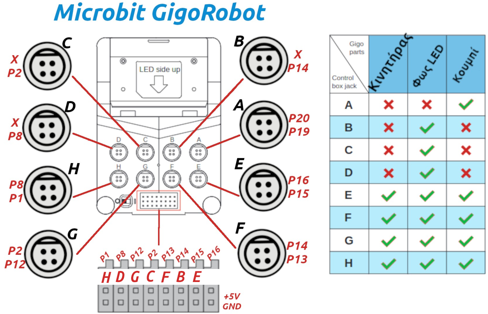
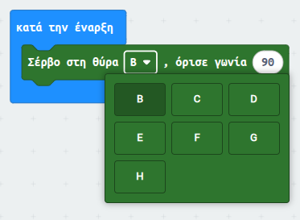

# pxt-makecode-gigo

## Περιγραφή

Για τον προγραμματισμό του κιτ Ρομποτικής Gigo υπάρχουν 2 βασικοί τρόποι:

0. Χρήση της εφαρμογής Mind+ με το αντίστοιχο πρόσθετο [εδώ](https://github.com/ale3andro/mindplus_ext_gigorobot)

1. Μέσω του Makecode με χρήση blocks από διάφορες κατηγορίες και ειδικά για τη χρήση του κινητήρα εισαγωγή [αυτού](https://github.com/gigotoys/gigo-block) του πρόσθετου. Αυτός ο τρόπος είναι ο προτεινόμενος στην επίσημη τεκμηρίωση του κιτ.

Επειδή ο προγραμματισμός μέσω Makecode τελικά γίνεται δυσκολότερος απ'όσο θα έπρεπε να είναι, ετοίμασα ένα και μόνο πρόσθετο το οποίο ενσωματώνει blocks για όλα περιφερειακά του κιτ (λαμπάκια led, κουμπί πίεσης, σέβρο, κινητήρες, αισθητήρες μαύρης γραμμής). Ο τρόπος χρήσης είναι εξαιρετικά απλός: αντί για εισαγωγή του πρόσθετου που αναφέρεται παραπάνω, αρκεί να γίνει εισαγωγή του πρόσθετου [αυτού](https://github.com/ale3andro/pxt-makecode-gigo). Στο περιβάλλον του Makecode, δημιουργείται μια νέα ομάδα εντολών με όνομα **Gigo Robot** η οποία περιλαμβάνει τα εν παρακάτω blocks.

## Ενδεικτικό σενάριο

## Συνδέσεις - αρίθμηση θυρών

Ένα από τα μεγαλύτερα προβλήματα του κιτ, κατά τη γνώμη μου, είναι η τελείως λανθασμένη αρίθμηση των θυρών του.

Για λόγους ευκολίας, παραθέτω την παρακάτω εικόνα με τα ονόματα των θυρών.

Το πρόσθετο "καθοδηγεί" στις συνδέσεις. Πχ αν θέλεις να συνδέσεις ένα σέρβο, χρησιμοποιώντας το αντίστοιχο block βλέπεις ότι μπορεί να συνδεθεί μόνο στις θύρες: B, C, D, E, F, G και Η.

**Προσοχή:** Εννοείται ότι αν συνδεθεί πχ ένα σέρβο στο C (στις κάτω πλακέ υποδοχές), δεν μπορεί να χρησιμοποιηθεί η πάνω στρόγγυλη C θύρα για κάτι άλλο (πχ για ένα led)!

## Εγκατάσταση - χρήση

Υπάρχουν οι 2 παρακάτω τρόποι. Διαλέγεις ότι σε βολεύει περισσότερο.

0. Ανοίγεις το makecode, πατάς το **+ Επεκτάσεις** και στη σελίδα που ανοίγει κάνεις επικόλληση το link αυτού του αποθετηρίου **https://github.com/ale3andro/pxt-makecode-gigo**

1. Κατεβάζεις από τα [releases](https://github.com/ale3andro/pxt-makecode-gigo/releases) του αποθετηρίου τo hex αρχείο με την τελευταία έκδοση και το κάνεις import από το **+ Επεκτάσεις** και μετά **Import File**.

Καλή διασκέδαση
