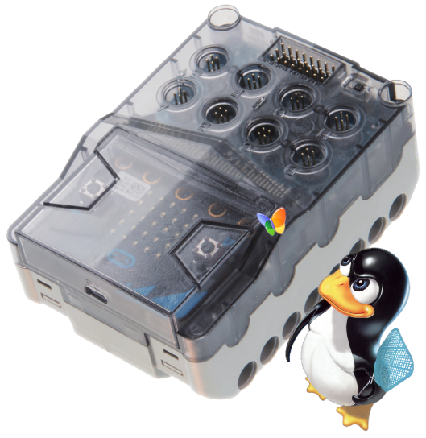
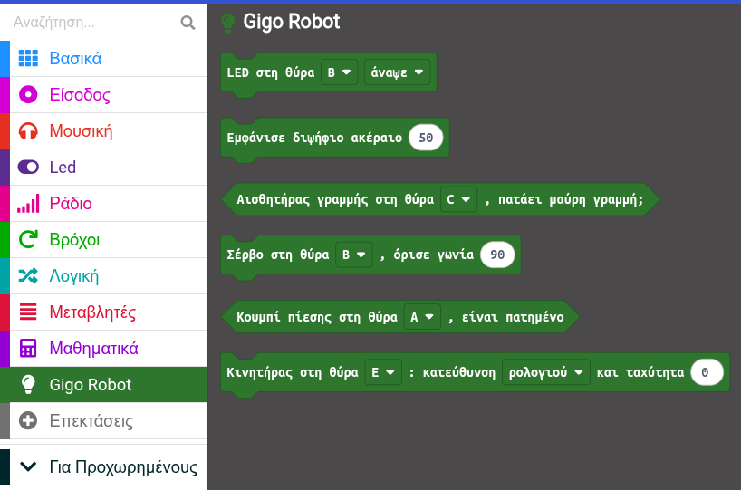
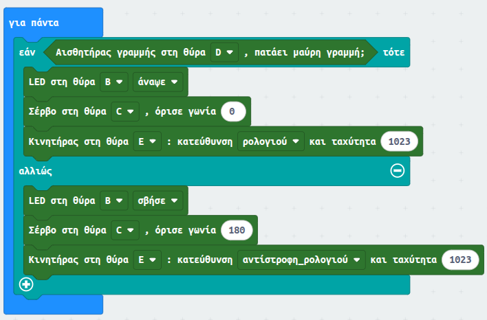

# pxt-makecode-gigo

## Περιγραφή

Για τον προγραμματισμό του κιτ Ρομποτικής Gigo υπάρχουν 2 βασικοί τρόποι:

0. Χρήση της εφαρμογής Mind+ με το αντίστοιχο πρόσθετο [εδώ](https://github.com/ale3andro/mindplus_ext_gigorobot)

1. Μέσω του Makecode με χρήση blocks από διάφορες κατηγορίες και ειδικά για τη χρήση του κινητήρα εισαγωγή [αυτού](https://github.com/gigotoys/gigo-block) του πρόσθετου.

Επειδή ο προγραμματισμός μέσω Makecode τελικά γίνεται δυσκολότερος απ'όσο θα έπρεπε να είναι, ετοίμασα ένα και μόνο πρόσθετο το οποίο ενσωματώνει blocks για όλα περιφερειακά του κιτ (λαμπάκια led, κουμπί πίεσης, σέβρο, κινητήρες, αισθητήρες μαύρης γραμμής). Ο τρόπος χρήσης είναι εξαιρετικά απλός: αντί για εισαγωγή του πρόσθετου που αναφέρεται παραπάνω, αρκεί να γίνει εισαγωγή του πρόσθετου [αυτού](https://github.com/ale3andro/pxt-makecode-gigo). Στο περιβάλλον του Makecode, δημιουργείται μια νέα ομάδα εντολών με όνομα **Gigo Robot** η οποία περιλαμβάνει τα εν λόγω blocks.

## Ενδεικτικό σενάριο

## Εγκατάταση χρήση

0. Ανοίγεις το makecode, πατάς το + Επεκτάσεις και στη σελίδα που ανοίγει κάνεις επικόλληση το link αυτού του αποθετηρίου **https://github.com/ale3andro/pxt-makecode-gigo**

1. Κατεβάζεις από τα [releases](https://github.com/ale3andro/pxt-makecode-gigo/releases) του αποθετηρίου τo hex αρχείο με την τελευταία έκδοση και το κάνεις import.

Καλή διασκέδαση
